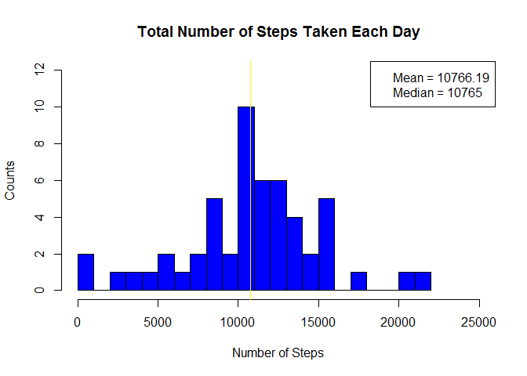
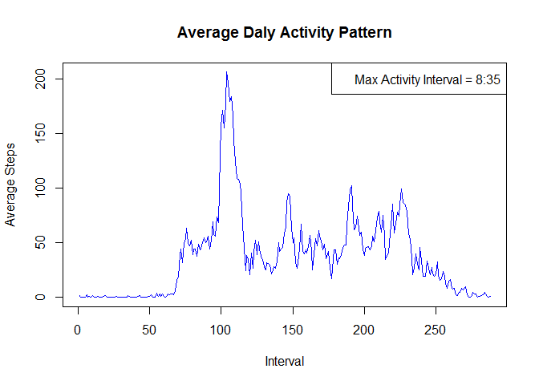
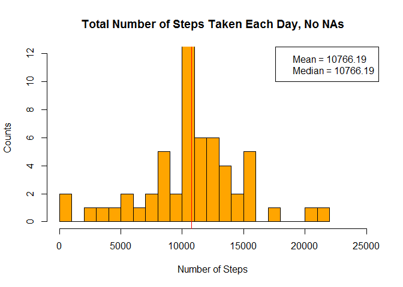
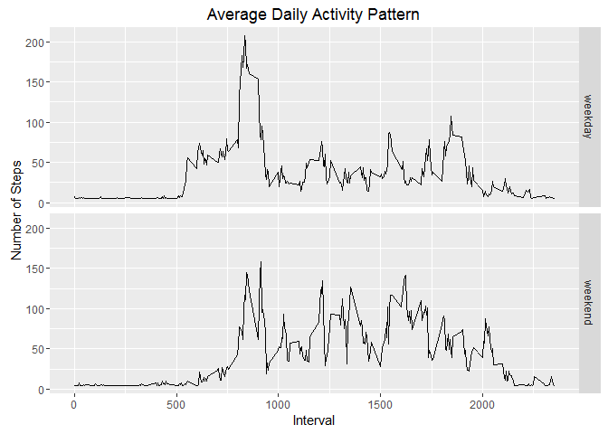

# Reproducible Research Project 1

This is an R Markdown document for the first project from the Reproducible Research course. The data analyzed here come from activity monitoring devices such as a Fitbit, Nike Fuelband, or Jawbone Up. The data are collected at 5 minute intervals through out the day. The dataset consists of two months of data from an anonymous individual collected during the months of October and November, 2012 and include the number of steps taken in 5 minute intervals each day. All plots are located in the Plots folder.

# Step 0: Start by downloading the data to your working directory.

# Step 1: Loading and preprocessing the data.

```r
##  Loading required packages
library(lubridate)
library(dplyr)
```

```
## 
## Attaching package: 'dplyr'
```

```
## The following objects are masked from 'package:lubridate':
## 
##     intersect, setdiff, union
```

```
## The following objects are masked from 'package:stats':
## 
##     filter, lag
```

```
## The following objects are masked from 'package:base':
## 
##     intersect, setdiff, setequal, union
```

```r
library(plyr)
```

```
## -------------------------------------------------------------------------
```

```
## You have loaded plyr after dplyr - this is likely to cause problems.
## If you need functions from both plyr and dplyr, please load plyr first, then dplyr:
## library(plyr); library(dplyr)
```

```
## -------------------------------------------------------------------------
```

```
## 
## Attaching package: 'plyr'
```

```
## The following objects are masked from 'package:dplyr':
## 
##     arrange, count, desc, failwith, id, mutate, rename, summarise,
##     summarize
```

```
## The following object is masked from 'package:lubridate':
## 
##     here
```

```r
library(ggplot2)
##  Reading the csv file and formatting the date
activity <- read.csv("activity.csv")
activity$date <- ymd(activity$date)
```

# Step 2: What is the mean total number of steps taken per day? 

```r
##  Creating tidy data to explor the number of steps per day    
hist_data <- ddply(activity, .(date), summarise, total_steps = sum(steps))
hist_data <- na.omit(hist_data)
##  Calculating the mean and the median
mean(hist_data$total_steps)
```

```
## [1] 10766.19
```

```r
median(hist_data$total_steps)
```

```
## [1] 10765
```

```r
##  Plotting the data and including the summary statistics
hist(hist_data$total_steps, breaks = 24, col = "blue", 
     main = "Total Number of Steps Taken Each Day",
     xlim = c(0, 25000),
     ylim = c(0, 12),
     xlab = "Number of Steps",
     ylab = "Counts"
     )
abline(v=mean(hist_data$total_steps), col = "yellow")
legend("topright", c("Mean = 10766.19", "Median = 10765"))
```



The average number of steps taken every day is 10,766. The distribution is fairly normal (see Plot1) with the median number of steps at close to the mean at 10,765. NAs are ignored because they do not influence the totals.

# Step 3: What is the average daily activity pattern?

```r
##  Creating tidy data to explore the average daily activity patterns
series_data <- ddply(activity, .(interval), summarise, average_steps = mean(steps, na.rm = T))
##  Calculating the value of the summary statistics
series_data[which.max(series_data$average_steps),]
```

```
##     interval average_steps
## 104      835      206.1698
```

```r
range(series_data$interval)
```

```
## [1]    0 2355
```

```r
##  Plotting the data and including the summary statistics
plot(series_data$average_steps, type = "l",
     main = "Average Daly Activity Pattern",
     xlab = "Interval",
     ylab = "Average Steps",
     col = "blue"
     )
legend("topright", "Max Activity Interval = 8:35")
```



The activity peak is at interval 835. Since the intervals cover 24 hours (range = 0-2355), the peak of the average daily activity is around 8:35 AM (see Plot2).

# Step 4: Imputing the missing values.

```r
##  Calculating NAs and creating new data
sum(is.na(activity$steps))
```

```
## [1] 2304
```

```r
activity_new <- activity
##  Replacing NAs with the average number of steps per five-minute interval
activity_new <- replace(activity_new, is.na(activity_new), mean(series_data$average_steps))
sum(is.na(activity_new))
```

```
## [1] 0
```

```r
##  Creating tidy data to explore the number of steps per day
hist_data <- ddply(activity_new, .(date), summarise, total_steps = sum(steps))
##  Calculating the mean and the median
mean(hist_data$total_steps)
```

```
## [1] 10766.19
```

```r
median(hist_data$total_steps)
```

```
## [1] 10766.19
```

```r
##  Plotting the data and including the summary statistics
hist(hist_data$total_steps, breaks = 24, col = "orange", 
     main = "Total Number of Steps Taken Each Day, No NAs",
     xlim = c(0, 25000),
     ylim = c(0, 12),
     xlab = "Number of Steps",
     ylab = "Counts"
     )
abline(v=mean(hist_data$total_steps), col = "red")
legend("topright", c("Mean = 10766.19", "Median = 10766.19"))
```



By replacing the NAs with the average number of steps per activity interval, the overall mean remains the same as with the NAs removed (see Plot3). The median shifts slightly and is now exactly equal to the mean.

# Step 5: Are there differences in activity patterns between weekdays and weekends?

```r
##  Adding and formatting new variable with values "weekday" and "weekend"
DayType <- factor(weekdays(activity_new$date) %in% c("Saturday","Sunday"), 
               labels=c("weekday","weekend"), ordered=FALSE)
##  Creating tidy data to explore the average daily activity patterns by type of day
series_data_new <- aggregate(activity_new$steps, by=list(interval=activity_new$interval, day=DayType), mean)
##  Plotting the activity patterns by type of day
g <- ggplot(series_data_new, aes(interval, x))
g + geom_line() + facet_grid(day ~ .) +
        labs(y="Number of Steps") +
        labs(x="Interval") +
        labs(title="Average Daily Activity Pattern")
```



The patterns are clearly different (see Plot4). During a typical workday, the activity is more concentrated in the morning hours when people go to work. During a typical weekend day, the activity is spread out throughout the day. Because weekday the data dominate the combined data (5 weekdays vs 2 weekend days), the overall pattern closely resembles that of a weekday.
